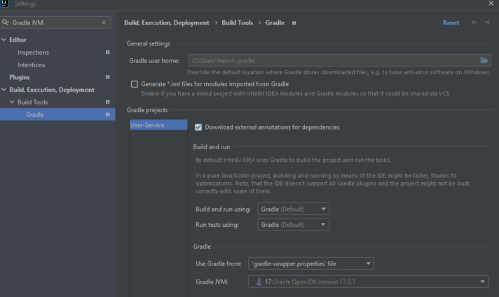

<br />
<div align="center">
<h3 align="center">PLAZOLETA SERVICE</h3>
  <p align="center">
This is a pragma challenge. In this repository will be all the logic of the plazoleta service.  </p>
</div>

### Built With

* 
* 
* 
* 


<!-- GETTING STARTED -->
## Getting Started

To get a local copy up and running follow these steps.

### Prerequisites

* JDK 17 [https://jdk.java.net/java-se-ri/17](https://jdk.java.net/java-se-ri/17)
* Gradle [https://gradle.org/install/](https://gradle.org/install/)
* MySQL [https://dev.mysql.com/downloads/installer/](https://dev.mysql.com/downloads/installer/)

### Prevent Possible Mistakes

* Make sure that the project structure uses SDK 17


* Now go to File/Settings and search for Gradle JVM, you have to choose 17 and click apply.
  


### Recommended Tools
* IntelliJ Community [https://www.jetbrains.com/idea/download/](https://www.jetbrains.com/idea/download/)
* Postman [https://www.postman.com/downloads/](https://www.postman.com/downloads/)

### Installation

1. Clone the repository
2. Change directory
   ```sh
   cd Plazoleta-Service
   ```
3. Create a new database in MySQL called powerup
4. Update the database connection settings
   ```yml
   # src/main/resources/application-dev.yml
   spring:
      datasource:
          url: jdbc:mysql://localhost/plazoleta-service
          username: root
          password: <your-password>
   ```
5. For now, the service has basic security
6. when you already have the postman collection that you can find later if you keep reading
7. Go to authorization, choose Basic Auth and in both fields write "admin"

<!-- USAGE -->
## Usage

1. Right-click the class PlazoletaServiceApplication and choose Run
2. Open [http://localhost:8092/swagger-ui/index.html](http://localhost:8092/swagger-ui/index.html) in your web browser
3. To use postman, the entire collection I decided to save [here](docs/postman/User-Service.postman_collection.json).

<!-- ROADMAP -->
## Tests

- Right-click the test folder and choose Run tests with coverage

## Feedback
If you have any comments about the repository, please tell me so I can improve :)

- 📫 How to reach me **heinnervega20@gmail.com**
